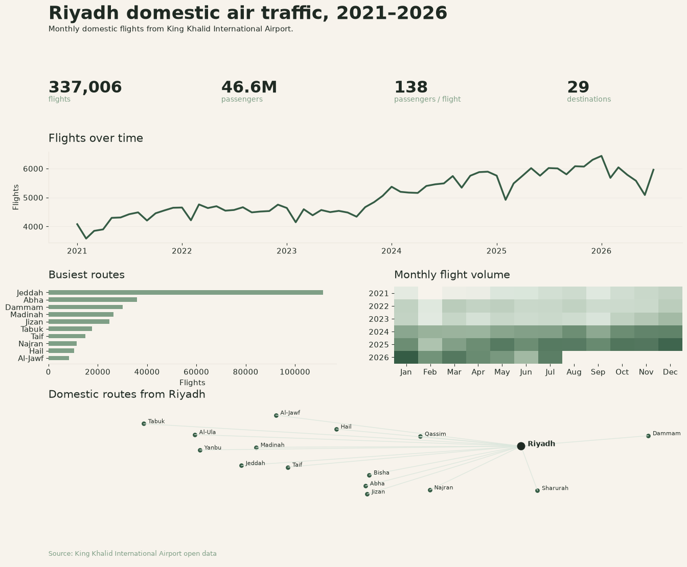

# Riyadh Domestic Air Traffic: 2021–2026

For this project, I used open data from King Khalid International Airport to look at domestic outbound air traffic from Riyadh between 2021 and 2026.

I looked at how flight volume changed over the years, which destinations were busiest, and whether there were any noticeable month-to-month patterns.

# Final visual!

## Data

Source: King Khalid International Airport Open Data 

Dataset: Domestic Flights, 2021–2026

The dataset included:

- Year & month
- Destination
- Inbound or outbound traffic
- Total flights per month
- Total passengers per month

## Process

- Standardized destination names that appeared in different formats
- Combined the year & month fields into a proper date column
- Filtered the data to focus on outbound flights from Riyadh
- Compared flight & passenger volume over time & across destinations
- Looked at monthly patterns
- Mapped domestic routes from Riyadh

## Tools

- Python
- pandas
- matplotlib

## Notebook

All of the analysis is here:

`notebooks/01_kkia_domestic_flights.ipynb`
## Data

Source: [King Khalid International Airport Open Data](https://www.kkia.sa/en/opendata)

Dataset: Domestic Flights, 2021–2026
